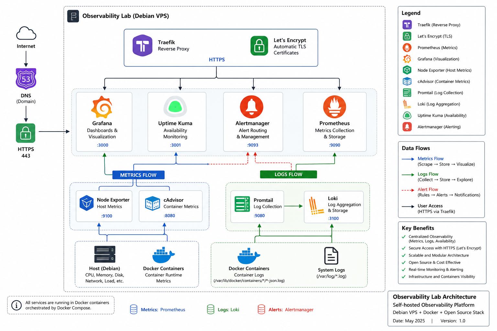
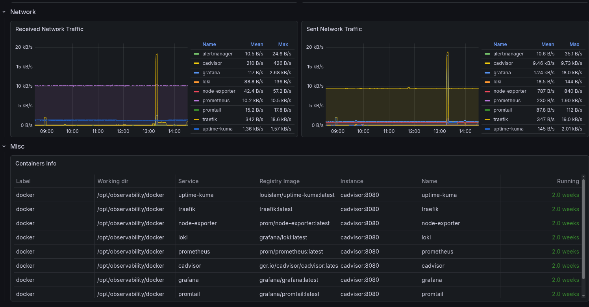
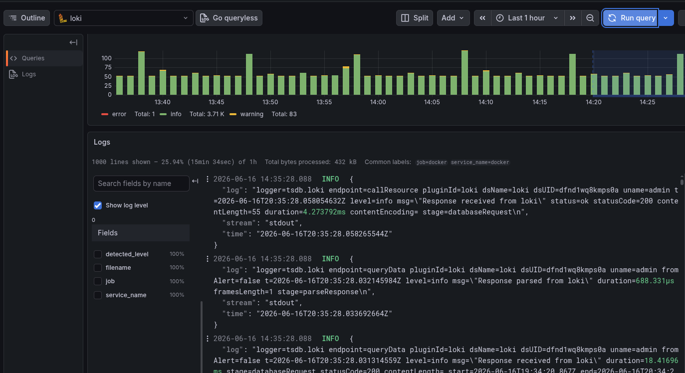
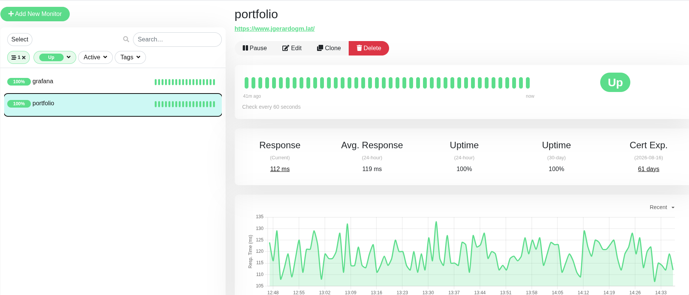

# Observability Lab


##  Overview

Observability Lab is a self-hosted observability platform deployed on a Debian VPS using Docker Compose.

The platform provides metrics collection, centralized logging, service availability monitoring, alerting, and secure HTTPS access through a modern open-source observability stack.

This project was built to strengthen practical skills in:

- Linux Administration
- Docker & Docker Compose
- Monitoring & Observability
- Infrastructure Operations
- DevOps Fundamentals
- Site Reliability Engineering (SRE) Concepts

---

##   Architecture Summary



The platform consists of the following services:

| Component | Purpose |
|------------|----------|
| Prometheus | Metrics collection and storage |
| Grafana | Dashboards and visualization |
| Node Exporter | Host-level metrics |
| cAdvisor | Container metrics |
| Loki | Log aggregation and storage |
| Promtail | Log collection |
| Uptime Kuma | Availability monitoring |
| Alertmanager | Alert routing |
| Traefik | Reverse proxy and HTTPS termination |
| Let's Encrypt | Automatic TLS certificates |

---
## Screenshots

### Grafana Dashboard



### Loki Log Explorer



### Uptime Kuma




##  Technology Stack

| Category | Technologies |
|-----------|-------------|
| Operating System | Debian Linux |
| Containerization | Docker, Docker Compose |
| Metrics | Prometheus |
| Visualization | Grafana |
| Logging | Loki, Promtail |
| Infrastructure Monitoring | Node Exporter |
| Container Monitoring | cAdvisor |
| Availability Monitoring | Uptime Kuma |
| Alerting | Alertmanager |
| Reverse Proxy | Traefik |
| TLS Certificates | Let's Encrypt |
| Version Control | Git, GitHub |

##  Infrastructure

- Debian Linux
- Docker
- Docker Compose

##  Monitoring

- Prometheus
- Grafana
- Node Exporter
- cAdvisor

## 󱂅 Logging

- Loki
- Promtail

## 󰍹  Availability Monitoring

- Uptime Kuma

### 󰀦  Alerting

- Alertmanager

### 󰒃 Networking & Security

- Traefik
- Let's Encrypt

---

## Features

### Infrastructure Monitoring

- CPU utilization monitoring
- Memory usage monitoring
- Disk utilization monitoring
- Network activity monitoring
- Host-level metrics collection

### Container Monitoring

- Docker container metrics
- Resource consumption visibility
- Container performance monitoring

### Centralized Logging

- Docker log collection
- Log aggregation with Loki
- Log exploration through Grafana
- Centralized log visibility

### Service Monitoring

- Endpoint monitoring
- Service availability checks
- Uptime tracking

### Alerting

- Alert management infrastructure
- Monitoring event visibility

### Security

- Automatic HTTPS certificates
- TLS termination through Traefik
- Let's Encrypt integration
- Secure public service exposure

---

## Project Structure

```text
observability-lab/
│
├── docker/
│   ├── compose.yaml
│   │
│   ├── prometheus/
│   ├── grafana/
│   ├── loki/
│   ├── promtail/
│   ├── node-exporter/
│   ├── cadvisor/
│   ├── uptime-kuma/
│   ├── alertmanager/
│   └── traefik/
│
├── docs/
│   ├── ARCHITECTURE.md
│   ├── CASE-STUDY.md
│   ├── DEPLOYMENT.md
│   └── LESSONS-LEARNED.md
│
├── diagrams/
│
├── screenshots/
│
└── README.md
```

---

## Deployment

Clone the repository:

```bash
git clone https://github.com/h13rbard/Observabilty-Infra.git
cd Observabilty-Infra.git
```

Start the stack:

```bash
docker compose up -d
```

Verify running services:

```bash
docker ps
```

---

## Learning Objectives

This project focuses on understanding:

- Docker-based infrastructure deployment
- Metrics collection and visualization
- Log aggregation and analysis
- Monitoring best practices
- Alerting workflows
- Service availability monitoring
- Reverse proxy configuration
- HTTPS certificate automation
- Infrastructure troubleshooting

---

## Future Improvements

Planned enhancements include:

- Dashboard provisioning as code
- Infrastructure as Code (IaC)
- Automated backup strategy
- Multi-host monitoring
- Advanced log labeling and filtering
- Alert notification integrations

---

## Documentation

Additional documentation is available in the `docs/` directory:

- Architecture documentation
- Deployment guide
- Case study
- Lessons learned

---

## Author
h13rbard
Personal DevOps and Observability project focused on practical infrastructure monitoring, centralized logging, service reliability, and operational visibility.
